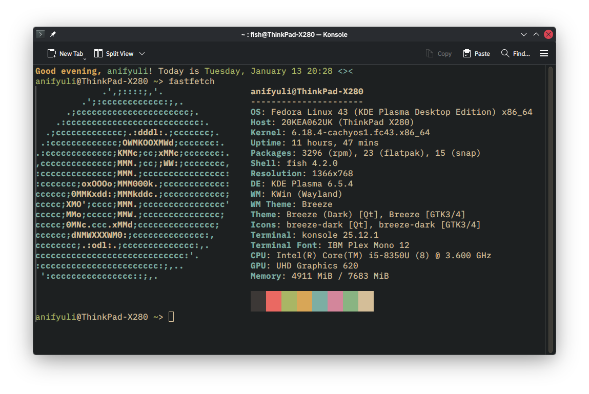

# Dotfiles

My personal dotfiles managed with [chezmoi](https://github.com/twpayne/chezmoi).

This repository contains user-space configuration files such as shell, terminal,
and text editor settings, designed to be reproducible across multiple machines.

## Included Configurations

### User-level configs

- Fastfetch
- Helix
- Fish shell
- Zed editor
- Konsole
- SSH client
- Tmux

## Preview

Konsole terminal appearance:

