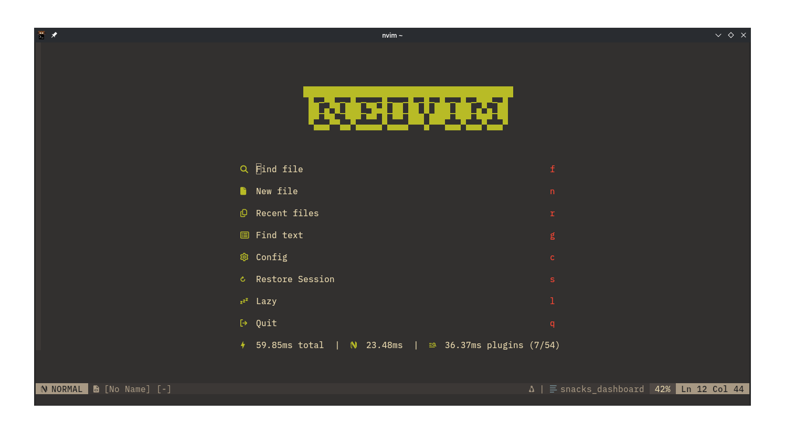
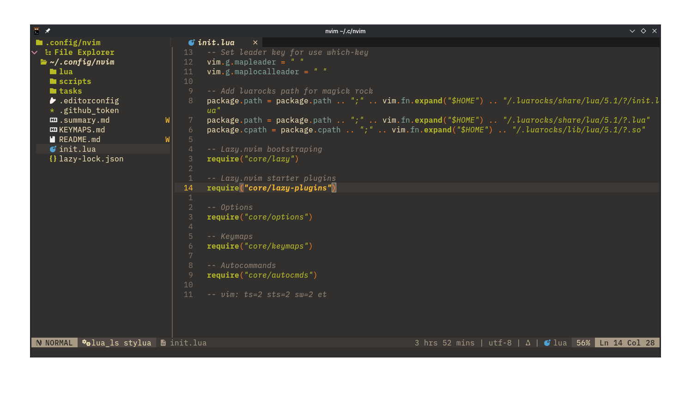
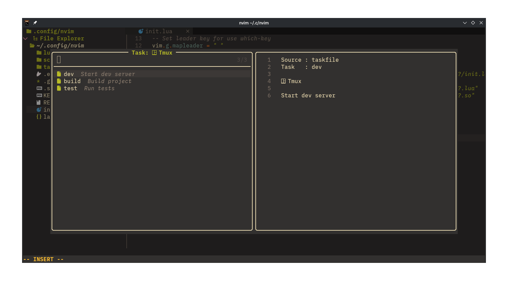

# Neovim Configuration

A modular Neovim configuration based on [kickstart-modular.nvim](https://github.com/dam9000/kickstart-modular.nvim), focused on TypeScript/JavaScript/React development with full IDE features.

This config lives inside a [Chezmoi](https://chezmoi.io) dotfiles repo at [github.com/Anifyuli/dotfiles](https://github.com/Anifyuli/dotfiles).

## Preview





## Requirements

- Neovim **>= 0.12.x** (uses `vim.uv`, `vim.lsp.config`, and other recent APIs)
- **Nerd Font** (for icons in which-key, statusline, bufferline, etc.)
- `git`, `make`, `unzip`, C compiler (for Treesitter and native plugins)
- **Optional:** `lazygit`, `ripgrep`, `fd`, `jq`, `tmux` (for enhanced search and task runner)

## Quick Start (with Chezmoi)

```bash
# Install Chezmoi
sudo dnf install chezmoi  # Fedora
# or: brew install chezmoi

# Apply dotfiles from the source repo
chezmoi init --apply https://github.com/Anifyuli/dotfiles.git

# Start Neovim — plugins will auto-install
nvim
```

### Day-to-day usage

```bash
# Edit a managed file (opens in $EDITOR)
chezmoi edit ~/.config/nvim/init.lua

# See pending changes
chezmoi diff

# Apply changes to home directory
chezmoi apply

# Commit and push all changes
chezmoi cd   # enter source directory
git add . && git commit -m "update nvim config"
git push
```

## Structure

```
~/.config/nvim/
├── init.lua                # Entry point
├── .editorconfig           # EditorConfig (2-space indent)
├── KEYMAPS.md              # Full keymap reference
└── lua/
    ├── core/
    │   ├── lazy.lua            # Lazy.nvim bootstrap
    │   ├── lazy-plugins.lua    # Plugin spec loader
    │   ├── options.lua         # Neovim options (swap /tmp//, foldmethod expr, etc.)
    │   ├── keymaps.lua         # Global keymaps (task runner, F7, folds, etc.)
    │   ├── autocmds.lua        # Autocommands (format-on-save, fold signs, etc.)
    │   └── github_token.lua    # GitHub token loader (functions.gitee)
    ├── pickers/
    │   └── task-picker.lua     # Universal task runner (mise, npm, VSCode, Zed, DAP)
    └── plugins/
        ├── snacks.lua       # Picker, image, dashboard, terminal, scroll, lazygit
        ├── ui.lua           # Which-key, bufferline, edgy, neo-tree, mini.comment
        ├── treesitter.lua   # Treesitter + textobjects + autotag
        ├── lspconfig.lua    # LSP, Mason, none-ls (format-on-save), lsp-file-operations
        ├── coding.lua       # Gitsigns, flash.nvim, neotest, autopairs, trouble
        ├── debugger.lua     # nvim-dap + dap-ui (breakpoints, scopes, repl)
        └── lang/
            ├── typescript.lua  # TS/JS DAP configs, ts_ls via vim.lsp.config()
            ├── http.lua        # Kulala .http client
            ├── markdown.lua    # Marksman, markdownlint, render-markdown
            ├── json.lua        # SchemaStore, jsonls
            └── tailwind.lua    # Tailwind LSP + color preview
```

## Features

### Editor

- Leader key mapped to `Space` with `which-key.nvim` popup (50ms delay)
- 2-space indentation, smart tabs via `vim-sleuth`
- Persistent undo (10k levels) + swap files in `/tmp//` (auto-clean on reboot)
- Tree-sitter folding with fold sign (`▾/▸`) in signcolumn following cursor
- Smart search (case-insensitive when all lowercase)
- Auto-create directories on save

### Theme & UI

- **Colorscheme:** Gruvbox (soft contrast, italic comments)
- **Dashboard:** Doom-style with startup timing stats (snacks.nvim)
- **Statusline:** tmux-powerline (minimalist-plus) with KDE dark/light auto-detect
- **Bufferline:** Bufferline.nvim with devicons, diagnostics; close via mini.bufremove; last buffer → dashboard
- **File explorer:** Neo-tree v3 with filesystem, buffers, git status sources

### Task Runner

- **`<leader>dd`** (`<leader>zr`): Universal task picker — runs from:
  - `mise tasks` (recursive via `find`)
  - `package.json` scripts
  - `.vscode/tasks.json` / `.vscode/launch.json`
  - `.zed/debug.json`
  - `~/.config/nvim/tasks/*.json`
- **Task mode toggle** (`<leader>dt`): `neovim` ↔ `tmux` (persisted to state file)
  - **Neovim mode:** Runs in Snacks terminal (edgy-managed, bottom)
  - **Tmux mode:** Creates persistent tmux windows in `nvim-tasks` session, survives Neovim restart
- **`<leader>dd`** in tmux mode: kill + recreate task window
- **`<leader>dD`**: Reopen last task terminal (scan tmux session or reuse shared terminal)
- **`<F7>`**: Toggle terminal (visible ↔ hidden ↔ create)
- **Cache:** 5min TTL (picker) / 10min (mise), prewarmed on module load, auto-invalidated on file write

### LSP & Completion

- **Mason** auto-installs LSP servers: `ts_ls`, `lua_ls`, `cssls`, `html`, `eslint`, `tailwindcss`, `marksman`
- **Formatters:** Prettier, Stylua via none-ls (format-on-save only via none-ls, not LSP)
- **nvim-cmp** with LSP, LuaSnip, path, and buffer sources
- **LSP progress handler** disabled (avoids tsserver spam)
- Auto-pairing for brackets
- **nvim-ts-autotag** on `InsertEnter`
- **nvim-lsp-file-operations** auto-updates imports on file rename/move (patched for Neovim 0.12)

### Coding Tools

- **Git:** Gitsigns (inline blame, hunk staging), lazygit (via snacks picker), `<leader>gb`/`<leader>gd` for blame/diff
- **Comments:** `gc` to toggle via mini.comment (custom TSX/JSX support)
- **Flash.nvim:** Enhanced `s`/`S`/`R`/`<c-s>` for label-based jumping
- **Neotest:** `<leader>zr` runs nearest test (adapter: plenary)
- **Indent guides** with snacks.scope
- **Trouble** panel for diagnostics and TODO/FIXME lists

### Debugging (DAP)

- JavaScript/TypeScript debug adapter via Mason
- Breakpoints: `<leader>db`/`<leader>dB`
- DAP UI with scopes, breakpoints, stacks, watches, REPL
- Configurations for Node.js, NestJS, React Native, Expo

### Terminal

- Single shared Snacks terminal for tmux tasks (no duplicate/synced terminals)
- `<F7>` toggle: visible ↔ hidden ↔ create
- `<leader>Th`/`<leader>Tv`/`<leader>Tf`: new terminals (horiz/vert/float)
- `<leader>Tt`: terminal picker
- Tmux task windows stay alive after command finishes (`; exec $SHELL`)
- `Ctrl-b n/p` inside attached terminal to navigate tmux windows

### Language Support

| Language              | LSP                 | Tools                                 |
| --------------------- | ------------------- | ------------------------------------- |
| TypeScript/JavaScript | `ts_ls`, `eslint`   | DAP, complete function calls          |
| Lua                   | `lua_ls`            | Neovim runtime library                |
| CSS/HTML              | `cssls`, `html`     | Tailwind color preview                |
| JSON                  | `jsonls`            | SchemaStore validation                |
| HTTP/REST             | `kulala` (built-in) | .http file execution, scripting, auth |
| Markdown              | `marksman`          | markdownlint, inline render           |
| Tailwind CSS          | `tailwindcss`       | Colorizer in completion menu          |

### Text Objects (Treesitter)

| Object    | Select      | Move                            |
| --------- | ----------- | ------------------------------- |
| Parameter | `aa` / `ia` | Swap: `<leader>a` / `<leader>A` |
| Function  | `af` / `if` | `]m` / `[m`                     |
| Class     | `ac` / `ic` | `]]` / `[[`                     |

## Keymaps

See [KEYMAPS.md](./KEYMAPS.md) for the complete reference.

**Quick highlights:**

| Key                     | Action                      |
| ----------------------- | --------------------------- |
| `Space+ff`              | Find files                  |
| `Space+/` or `Space+sg` | Live grep                   |
| `Space+e`               | File explorer               |
| `Space+gl`              | LazyGit                     |
| `Space+dd`              | Run task                    |
| `Space+dt`              | Toggle task mode            |
| `Space+Th/v/f`          | Terminal (horiz/vert/float) |
| `F5`                    | Debug continue              |
| `F7`                    | Toggle terminal             |
| `gd`                    | Go to definition            |
| `K`                     | Hover documentation         |
| `s` / `S` / `R`         | Flash jump (label-based)    |

## Plugins (~50 total)

Managed by [lazy.nvim](https://github.com/folke/lazy.nvim). Press `Space+L` or run `:Lazy` to manage.

Core: gruvbox, which-key, snacks.nvim, neo-tree, bufferline, treesitter, nvim-cmp, lspconfig, mason, gitsigns, trouble, nvim-dap, dap-ui, flash.nvim, neotest, render-markdown, kulala.

## Notes

- `lazy-lock.json` is NOT tracked by chezmoi — lazy.nvim manages it independently
- Swap files go to `/tmp//` (ephemeral, no E325 recovery prompts)
- Format-on-save only via none-ls (not LSP); `$/progress` handler disabled
- Terminal buffers are filtered out from bufferline and session management
- DAP UI opens on debug start, closes on termination
- The `q` key closes special buffers (help, LSP info, quickfix, etc.)
- Task mode persists across Neovim restarts via `~/.local/state/nvim/task_mode`
- `snacks.image` requires a terminal that supports the **Kitty Graphics Protocol** (Kitty, WezTerm, Ghostty). Konsole (KDE) only supports Sixel — images won't display.
- When running inside Neovim's built-in terminal, `Ctrl-\ Ctrl-n` exits to normal mode
